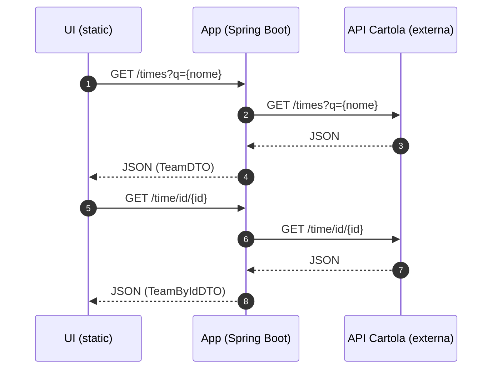

# Explicação: arquitetura

## Visão geral

Esta aplicação Spring Boot atua como uma **camada de consumo** da API oficial do Cartola FC (`https://api.cartola.globo.com`), expondo endpoints REST e servindo uma UI estática.

O backend usa `RestTemplate` e inclui `User-Agent: Mozilla/5.0` nas requisições para a API externa.

## Estrutura de pacotes

- `com.api.cartolafc` – aplicação Spring Boot
- `config/` – configuração (ex.: `RestTemplate`)
- `controllers/` – endpoints REST + anotações OpenAPI
- `services/` – chamadas à API do Cartola e regras de negócio
- `dtos/` – records para serialização/deserialização JSON
- `utils/` – constantes e funções utilitárias (ex.: `BASE_URL`, normalização)

## Fluxo (alto nível)

## Endpoints e responsabilidades

- `controllers/*Controller.java`: valida parâmetros, retorna `ResponseEntity`, e documenta com OpenAPI.
- `services/*Service.java`: monta URL externa, faz `exchange()` com `RestTemplate` e mapeia DTOs.

